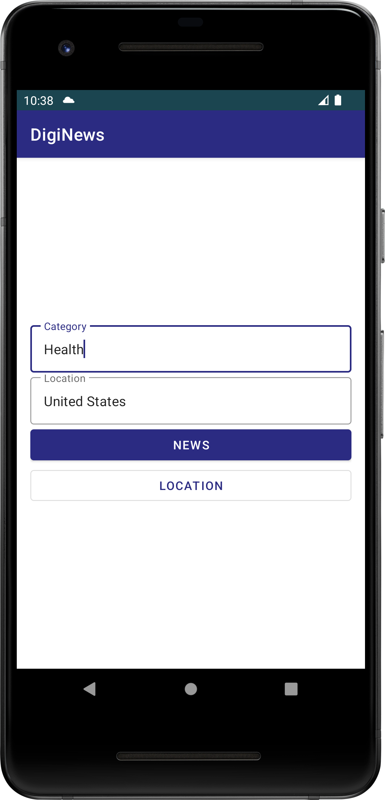

# News Finder App

The News Finder App is an Android application that allows users to find news from any area and on different topics. The app supports both English and Arabic languages and comes with a sleek and elegant design that is available in both dark and light themes.

 

  

## Features

- Find news from any area
- Search for news on different topics
- Supports English and Arabic languages
- Sleek and elegant design available in both dark and light themes

## Installation

To install the app, simply download the APK file from the release section of the project repository and install it on your Android device.

## Usage

1. Upon opening the app, users are greeted with a simple and intuitive interface that allows them to choose their preferred language and theme.

2. Users can then enter the area they want to find news about and select the topic they are interested in.

3. The app then displays a list of news articles related to the user's search criteria.

4. Users can click on any article to view the full details of the news, including images and videos.

5. The app also includes a search function that allows users to search for news on specific topics or from specific sources.

## Technologies Used

The News Finder App is built using the following technologies:

- Java programming language
- Android Studio IDE
- Firebase for backend services
- Retrofit for REST API calls
- Material Design Components for UI design

## License

The News Finder App is licensed under the MIT License. Please see the LICENSE file for more information.
